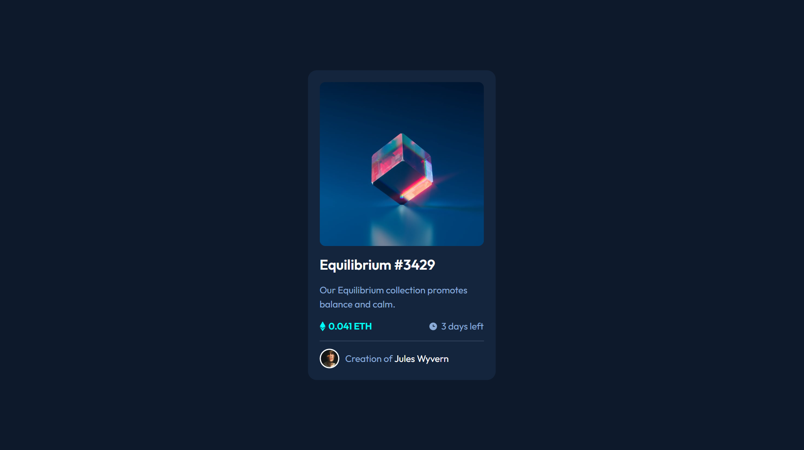
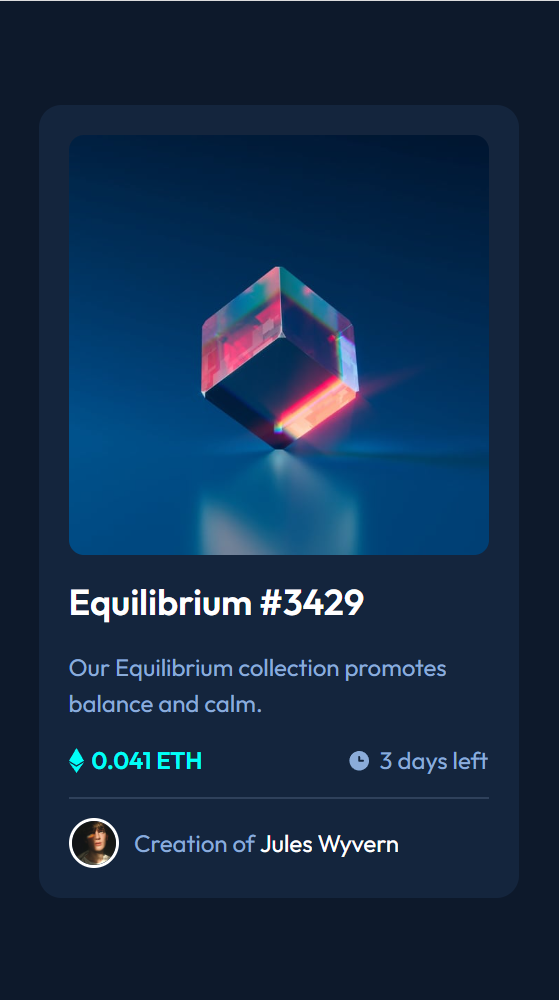

# Frontend Mentor - NFT preview card component solution

This is my personal solution to the [NFT preview card component challenge on Frontend Mentor](https://www.frontendmentor.io/challenges/nft-preview-card-component-SbdUL_w0U). Frontend Mentor challenges help you improve your coding skills by building realistic projects, they provide you with a jpg of what the design or component should look like at each viewport width and then you write the code to make the design a functional website.  

## Project Overview and Reflections

Embarking on this project presented both challenges and opportunities. At a glance, it seemed straightforward, yet the requirements around the main image's active/hover state unfolded into an intriguing puzzle. One of the highlights of this project was the chance to revisit and hone my knowledge of CSS positioning. Specifically, I employed 'position: relative' for the image and 'position: absolute' for the overlay, ensuring they interacted precisely as intended.

The core challenge lay in creating an opaque overlay without concurrently diminishing the overlay icon's opacity. My solution entailed setting the overlay opacity to zero, adjusting it to full opacity during hover. This approach ensured maximum visibility for the view/eye icon. Additionally, by using hsla for the overlay's background color during hover, I could achieve a 0.4 opacity, perfectly mirroring the design files. This was a wonderful refresher of foundational CSS concepts, that I often hadn't required in my projects recently.

## Table of contents

  - [Screenshot](#screenshot)
  - [Links](#links)
  - [Built with](#built-with)
  - [Author](#author)

### Screenshot
##### Desktop View - Below (1440px viewport width)

##### Mobile View - Below (375px viewport width)

### Links

- Solution URL: [https://github.com/jacksen30/Nft-card-component]
- Live Site URL: [https://nft-card-component-jn.netlify.app/]

### Built with

- Semantic HTML5 markup
- CSS 3
- CSS FLEX layout 

## Author

- Website - [Jacksen Nillson](https://devbyjacksen.com/)
- Frontend Mentor - [@jacksen30](https://www.frontendmentor.io/profile/jacksen30)